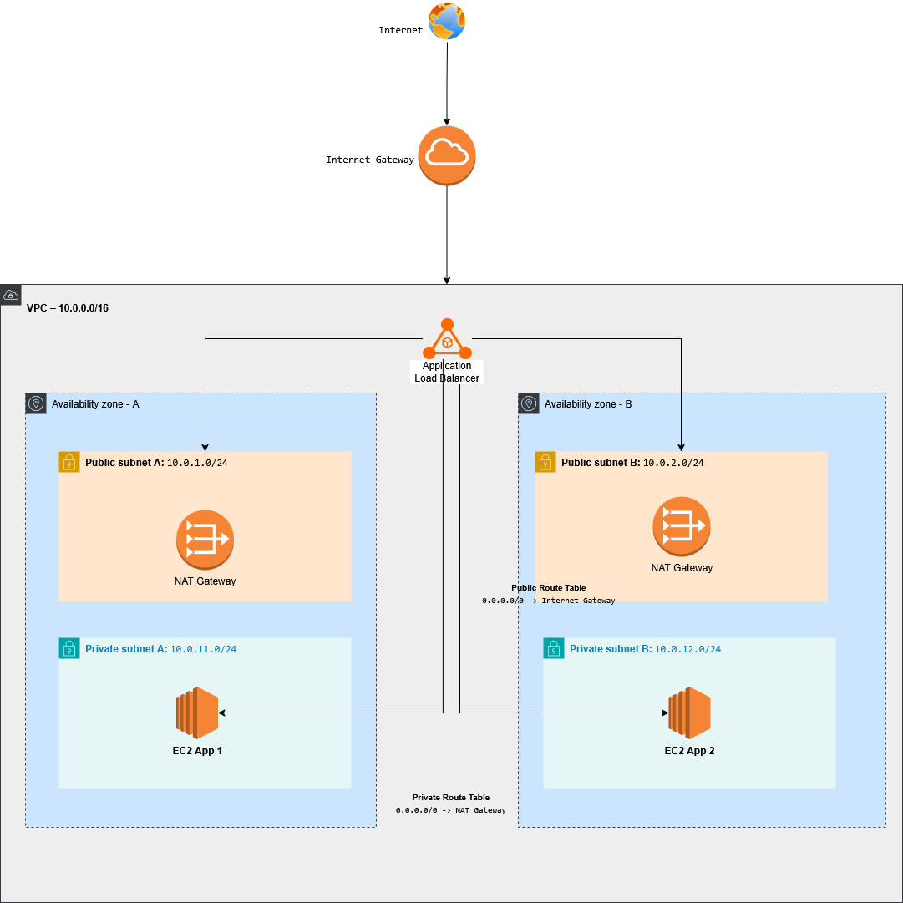

# AWS Infrastructure & Security Labs

A collection of hands-on AWS projects focused on resilient network design, security best practices, and least-privilege architecture.

---

## Project 1: Multi-AZ VPC Architecture with Public and Private Subnets

This project demonstrates a multi-tier AWS network architecture designed to improve availability, isolate workloads, and enforce controlled ingress and egress patterns. The lab was built to reflect core AWS architecture and cloud security concepts commonly used in real-world environments.

### Architecture Goals
- Deploy resources across two Availability Zones for improved resilience
- Separate public-facing and private workloads using subnet segmentation
- Allow inbound application traffic only through a public-facing Application Load Balancer
- Allow outbound internet access for private instances through NAT Gateways
- Apply layered access control using Security Groups and route table separation

### Key Components
- 1 VPC (`10.0.0.0/16`)
- 2 Public Subnets
- 2 Private Subnets
- 1 Internet Gateway
- 2 NAT Gateways
- 1 Application Load Balancer
- 2 EC2 Application Instances
- Public and Private Route Tables

### Traffic Flow
- Internet traffic enters through the Internet Gateway
- The Application Load Balancer receives public HTTP traffic
- The ALB forwards requests to EC2 application instances in the private subnets
- Private instances use NAT Gateways for outbound internet access without being directly exposed

### Security Considerations
- EC2 instances are placed in private subnets with no direct public IP exposure
- Public access is limited to the load balancer layer
- Security Groups are used to restrict application traffic to only the ALB
- Route tables separate public ingress from private outbound traffic

### Terraform Implementation
This project also includes a Terraform implementation of the architecture shown in the diagram. The Terraform configuration is intended to model the infrastructure as code, including:
- VPC and subnet creation
- Internet Gateway and NAT Gateways
- Public and private route tables
- Application Load Balancer
- EC2 application instances
- Security Groups and target group configuration

### How to Run

This lab is intended to be deployed temporarily for testing and learning purposes.

1. `terraform init`  
   Initialize Terraform and download the AWS provider.

2. `terraform plan`  
   Review the execution plan and validate the resources to be created.

3. `terraform apply`  
   Deploy the lab infrastructure into AWS.

4. `terraform destroy`  
   Remove all resources after testing to avoid unnecessary cost.

### Notes
This is a lab environment created for architecture practice, security design review, and infrastructure-as-code learning. It is not presented as a production-ready deployment.

## Future Improvements
- HTTPS listener with ACM certificates
- Auto Scaling Group for application instances
- CloudWatch alarms and logging expansion
- VPC Flow Logs
- AWS WAF integration
- More modular Terraform structure

